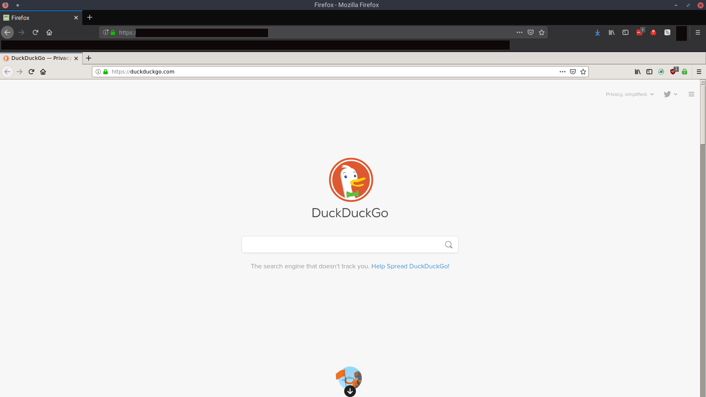

# Foxception

## Browser in a browser

This container runs a web server that serves an actual Firefox browser when you navigate to it. Under the hood, the container is running xRDP over Apache Guacamole to serve up the Firefox window.

This project was inspired by [this blog post](http://ivo2u.nl/Yo). IvoNet's creation is really cool, but I thought I would build my own and add some improvements. First, I updated the apache guacamole image to a more current one. Then I switched the browser to Firefox and figured out how to sideload extensions so that they are already baked into the browser when you build the image. Lastly, I created a seccomp whitelist filter for added security.

This build includes Firefox and the PIA vpn extension. The Dockerfile also has commented out lines for uBlock Origin, Decentraleyes, and Privacy Badger. They have been commented out to help with stability, but you can easily uncomment them to suit your needs. 

## Installation / running the image

#### The quick and dirty way

This image is published on Docker Hub, and you can run it with the command:

`$ docker run -d --rm --shm-size=1G -p 8080:8080 --name foxception lawndoc/foxception:Privacy`

It is important to include all of the flags in order for this docker container to run and close properly. I recommend you read up on all of the flags being used and what they mean (see IMPORTANT NOTE below).

#### Running with Seccomp

You can run this image with a seccomp filter to minmize the permitted syscalls of the container in the event of successful exploitation. To do this, you clone this repo, build an image with the provided script, and run with the provided seccomp filter:

`$ git clone https://github.com/doctormay6/foxception.git`

`$ cd foxception`

`$ ./build.sh`

`$ sudo docker run -d --shm-size=1G -p 8080:8080 --security-opt seccomp=foxception_seccomp.json --name foxception lawndoc/foxception:Privacy`

The seccomp filter was made with [this tool](https://github.com/doctormay6/oci-seccomp-bpf-hook) which logs all syscalls made to the kernel and then generates a seccomp filter when you stop the container. The provided filter allows only the syscalls required for this container to function as it was intended. I highly recommend using the seccomp filter because I haven't done any kind of vulnerability analysis on this service (see IMPORTANT NOTE below).

Also, keep in mind that if you modify the container too much it may require additional syscalls that are not whitelisted by the provided seccomp filter. In that scenario, you can use the tool mentioned above to generate a new filter.

## Choosing your own extensions

To pick your own default extensions, you need to add the xpi archive to the directory /usr/share/mozilla/extensions/{ec8030f7-c20a-464f-9b0e-13a3a9e97384}/

The archive must be named &lt;app id>.xpi where &lt;app id> is the application id of the add-on. For example, {ec8030f7-c20a-464f-9b0e-13a3a9e97384} is the app id of Firefox, and is the name of the directory that you should add the xpi archives to. You can find the app/extension id of any add-on that you already have by going to about:debugging in your local Firefox browser.

To download an extension, just do a curl like in the Dockerfile. You can get the download url of the add-on's xpi archive by going to the Firefox add-ons website and hovering over or right-clicking the "Add to Firefox" button.

## IMPORTANT NOTE:

Depending on your setup, this browser may be exposed to the internet. Since it is running on your network, anything that is done on the browser will be tied back to the host network. Therefore, make sure you know where it is accessible from and control access with firewalls, htpasswd, etc... Also, I have not performed any vulnerability analysis on this container, so it very well may be able to do things it wasn't intended to do. For that reason, you should also run this container with the provided seccomp filter as instructed above.
